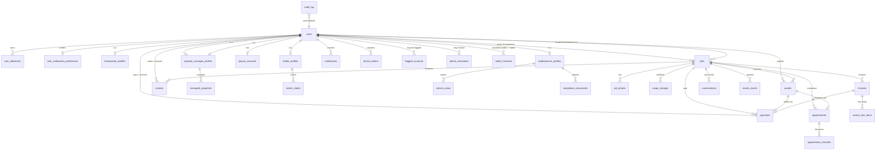

# TradesOn — Entity Relationship Diagram

> Cloud SQL (Postgres 16) is the source of truth for all transactional data. Firestore is reserved for messaging + a few admin/audit collections; it is **not** part of this ERD. See `CLAUDE.md` → "Architecture — Where Data Lives" for the boundary.

## Live ERD

> Mermaid renders inline on GitHub. If you're reading this in another viewer that doesn't render, paste into https://mermaid.live to view.

## Tables — what each one is for

### Identity & profile (per user)

| Table | Purpose |
|---|---|
| `users` | Master user row. `firebase_uid` ties to Firebase Auth. `role` is one of `homeowner / property_manager / realtor / licensed_tradesperson / unlicensed_tradesperson / admin`. |
| `user_addresses` | One or more addresses per user (mailing, billing, etc.) — separate from role-specific addresses. |
| `user_notification_preferences` | SMS / email / push toggles. One row per user. |
| `homeowner_profiles` | Homeowner-specific fields: property address, type, service interests. |
| `property_manager_profiles` | PM-specific: company, job title, plan type. |
| `managed_properties` | Multi-property portfolio for a PM (one PM → many properties). |
| `realtor_profiles` | Realtor-specific: brokerage name, license number, service radius. |
| `realtor_clients` | Email-based client invitations a Realtor sends to homeowners. |
| `realtor_favorites` | Tradespeople a Realtor has marked as favorites (for quick re-hire). |
| `tradesperson_profiles` | Tradesperson-specific: business name, primary trades, sub-services, ID/insurance flags, Stripe Connect, rating, jobs_completed, **compliance status** (the admin review decision). |
| `service_areas` | Zip codes a tradesperson serves beyond their service radius. |
| `compliance_documents` | Tradesperson licenses + expiration dates + verification status. |
| `payout_accounts` | Stripe Connect Express account info for a tradesperson. |

### Job lifecycle

| Table | Purpose |
|---|---|
| `jobs` | The core job record. Joins homeowner (`homeowner_user_id`) ↔ tradesperson (`assigned_tradesperson_id`). Carries `status`, `category`, `severity`, `intake_answers` (JSONB structured intake), `sub_service`, AI summary, location. |
| `job_photos` | Photos attached to a job (intake / before / after / completion). |
| `quotes` | Tradesperson bids on a job. Carries price, hours, hourly_overage_rate, status, `tool_inventory` (JSONB — Kevin's per-quote tools checklist). |
| `appointments` | Scheduled visit. References both job + quote. Tracks `status`, arrival_eta, started_at, completed_at. |
| `appointment_checklist` | Itemized job tasks the tradesperson checks off on-site. |
| `scope_changes` | Tradesperson-initiated scope changes mid-job (with price delta and customer approval). |

### Payments

| Table | Purpose |
|---|---|
| `payments` | One row per money movement. Carries `amount`, `platform_fee` (10%), `net_payout`, Stripe IDs, status. |
| `invoices` | Customer-facing invoice (subtotal + tax + total + PDF URL). |
| `invoice_line_items` | Itemized lines on an invoice. |

### Reviews + Communication

| Table | Purpose |
|---|---|
| `reviews` | 1–5 star + comment. UNIQUE per `(job_id, reviewer_id)` so a job can't be reviewed twice by the same person. |
| `conversations` | Metadata for a messaging thread between participants. **Actual messages live in Firestore** (`threads/{id}/messages/`); this table just tracks the participant list + last_message_at. |
| `notifications` | Per-user notification log (push/email/sms channel, delivered/read). |
| `device_tokens` | FCM tokens for push notifications. |

### Admin + audit

| Table | Purpose |
|---|---|
| `flagged_accounts` | Open admin queue. Severity high/medium/low. Source: dispute / poor_reviews / expired_insurance / suspicious_activity. |
| `admin_resolutions` | Admin's action on a flagged account: warning / suspension / deactivation / explanation_request. |
| `audit_log` | Immutable append-only record of every admin action + every server-side mutation worth tracking. |
| `match_events` | Matching algorithm telemetry — every Job Board view (`shown`), quote action (`quoted`, `accepted`), and outcome (`completed`). Feeds future ML training. |

## Cross-reference — Firestore vs Postgres

| Lives in Postgres | Lives in Firestore |
|---|---|
| Everything above | `threads/`, `messages/` (real-time chat) |
| | Optional: future `audit_log` mirror via Firebase Extensions |

Total Postgres tables: **30** (26 base + 4 additive in commit `5667df5` and `d026489`). Schema is in `api/src/schema/migration.sql`.
